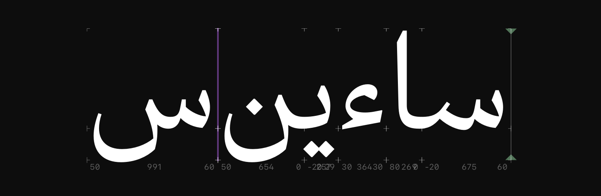

# Show Zero-Width Glyphs

This is a plugin for the [Glyphs font editor](https://glyphsapp.com) that draws colored lines to indicate the presence of zero-width glyphs in Edit View.



## Installation

[Install **Show Zero-Width Glyphs** in Glyphs](https://florianpircher.com/glyphs/plugins/show-zero-width-glyphs/install)

Install the plugin using the link above or search for “Show Zero-Width Glyphs” in the Plugin Manager.
Relaunch Glyphs for the plugin to be loaded.

## Preferences

Show Zero-Width Glyphs offers a range of configurable preferences.

### Line Color

The `ShowZeroWidthGlyphsLineColor` preference controls the color of the indicator line.
Set the preference to `8` for the default purple color or one of the following numbers:
`0`: red, `1`: orange, `2`: brown, `3`: yellow, `4`: green, `7`: blue, `8`: purple, `9`: pink, `10`: gray.

Run the following line in the Macro panel to set the color (or set it to `None` to reset it):

```python
Glyphs.defaults["ShowZeroWidthGlyphsLineColor"] = 1
```

### Line Alpha Value

The `ShowZeroWidthGlyphsLineAlphaValue` preference controls the transparency of the indicator line.
Set the preference to `0.5` for the default transparency.
`1.0` makes the line fully opaque, and `0.0` hides the line (full transparency).

If there are multiple zero-width glyphs next to each other, transparent colors will overlay, resulting in a more prominent line.

Run the following line in the Macro panel to set the alpha value (or set it to `None` to reset it):

```python
Glyphs.defaults["ShowZeroWidthGlyphsLineAlphaValue"] = 0.25
```

### Line Thickness

The `ShowZeroWidthGlyphsLineThickness` preference controls the thickness of the indicator line.
This thickness is added on all four sides of the layer box.
The default value is `1.0`.

Run the following line in the Macro panel to set the thickness (or set it to `None` to reset it):

```python
Glyphs.defaults["ShowZeroWidthGlyphsLineThickness"] = 5.0
```

### Maximum Width

The `ShowZeroWidthGlyphsMaximumWidth` preference controls the maximum layer width for which the highlighting is applied.
The default value is `0` (only zero-width glyphs are highlighted).
Set it to a small value like `5` or `10` to also catch other very narrow glyphs.

Run the following line in the Macro panel to set the maximum width (or set it to `None` to reset it):

```python
Glyphs.defaults["ShowZeroWidthGlyphsMaximumWidth"] = 10
```

## Licenses

Licensed under the [Apache License, Version 2.0](http://www.apache.org/licenses/LICENSE-2.0).
